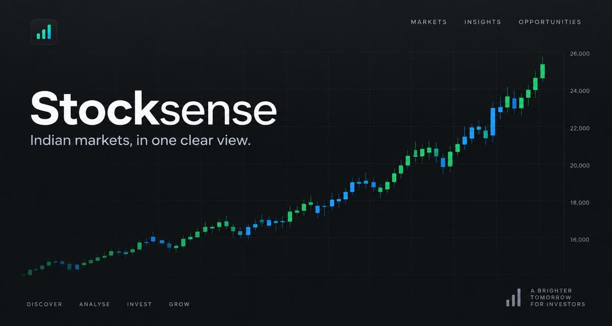

# StockSense

A decision dashboard for Indian equity markets. StockSense brings NSE/BSE quotes, market breadth, sector context, movers, macro events and sourced news into one responsive React application.

**Live app:** https://stocksensee.netlify.app/



## Why this project is different

- Live market views backed by Yahoo Finance and server-side Supabase functions
- Auditable, deterministic trade signals instead of unexplained AI recommendations
- Rich simulated fallbacks keep the showcase explorable when live providers are unavailable
- Responsive dashboard, theme support, stock search and local watchlists
- Edge functions keep upstream market requests and service configuration off the client

> StockSense is educational software, not financial advice. Prices can be delayed or unavailable. Verify data with an exchange or broker before trading.

## Stack

React 18, TypeScript, Vite, TanStack Query, Tailwind CSS, shadcn/ui, Recharts, Supabase Edge Functions.

## Local development

```bash
npm install
cp .env.example .env
npm run dev
```

Create a Supabase project and add its public browser configuration to `.env`. Never put service-role keys, provider secrets, or model API keys in a `VITE_` variable because Vite exposes those values to the browser bundle.

```env
VITE_SUPABASE_PROJECT_ID=your-project-id
VITE_SUPABASE_URL=https://your-project.supabase.co
VITE_SUPABASE_PUBLISHABLE_KEY=your-public-anon-key
```

## Quality checks

```bash
npm run lint
npm run build
```

## Free data sources

StockSense uses sources that do not require a paid API plan or billing setup:

- Yahoo Finance public chart endpoints for delayed quotes and history
- Publisher-provided RSS feeds from Economic Times, Moneycontrol and Mint for headlines
- Public NSE endpoints for selected market breadth, options and bulk/block-deal views

These sources can rate-limit, change or become temporarily unavailable. The edge functions cache and bound requests; the UI keeps a clearly labeled simulated fallback for the portfolio demo. Do not remove publisher attribution or republish full article text. Headline links lead to the original publisher. Review each source's current terms before commercial use.

## Data and trust model

Browser code calls Supabase Edge Functions for market data. External feeds can fail or throttle requests. StockSense keeps the portfolio experience explorable with sample and simulated fallbacks, and the UI labels that behavior instead of implying every value is live. AI analysis remains disabled, so the project does not claim AI-generated investment calls.

## Project structure

- `src/pages` - route-level screens
- `src/components` - dashboard and reusable UI
- `src/services` - client data orchestration
- `supabase/functions` - server-side market and signal endpoints
- `scripts` - build-time utilities such as sitemap generation

## Security

If a secret is ever committed, deleting it from the latest commit is not enough. Revoke it at the provider and remove it from Git history. Only public Supabase anon configuration belongs in the browser.

## License

No license has been selected yet. All rights reserved by the repository owner.
